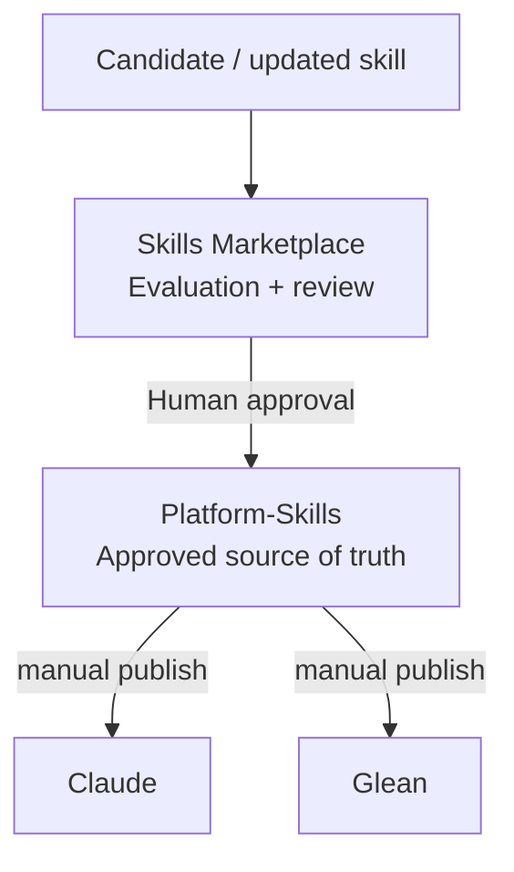
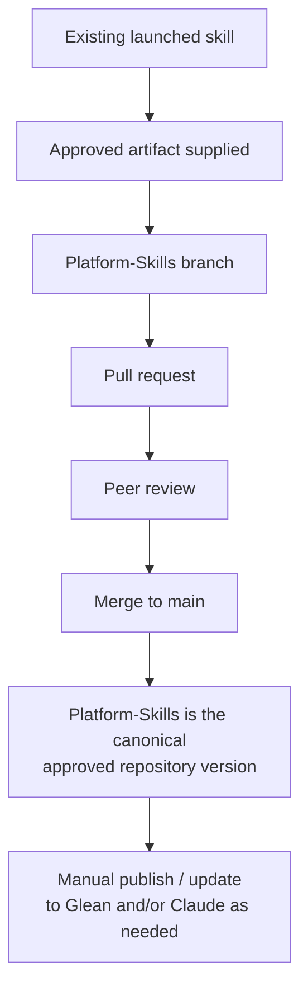
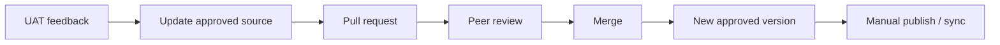

# Platform-Skills

**Skills Marketplace is where we review. Platform-Skills is where the approved version lives.**

Platform-Skills is the source of truth for AHEAD's approved, reusable platform skills and their version history. It is an internal Enterprise GPT team repository.

## What this is, and what it is not

Platform-Skills **is**:

- the single home of each approved skill, so a skill is updated once rather than edited separately on each platform
- the version history of those skills: every change is a pull request with a reviewer
- the place the team publishes from when it manually updates Claude and Glean

Platform-Skills **is not**:

- the review or evaluation workflow. That is [Skills Marketplace](#relationship-to-skills-marketplace), a separate repository.
- a broad, company-wide Marketplace or intake channel
- automated publishing. Publishing to Claude and Glean is a manual step.
- a place for credentials, runtime infrastructure, or operational state

## Relationship to Skills Marketplace

The two repositories are deliberately separate:

| Repository | Role |
| --- | --- |
| Skills Marketplace | Evaluation and review of a new or updated skill before it is promoted |
| Platform-Skills (this repo) | Source of truth for approved skills and their version history |



Human review is the approval gate. Automated checks in Skills Marketplace can support the reviewer, but nothing is promoted without a person approving it.

## What belongs here

- Approved skill packages, under [`skills/`](skills/README.md)
- Short pointers to the skill standard, under [`standards/`](standards/README.md)
- Contribution and review guidance ([CONTRIBUTING.md](CONTRIBUTING.md))

The initial reference set is `ahead-skill-package-builder`, the platform skills already launched by Enterprise GPT, and the existing AHEAD skill standard.

## What does not belong here

- Credentials, API keys, tokens, or other secrets
- Unapproved or experimental candidate skills (they go through Skills Marketplace first)
- Marketplace evaluation logic, AI judging, or review state
- Deployment, sync, or notification infrastructure
- Client data or other confidential material

## How a skill moves

1. **Candidate**: a new or updated skill is drafted.
2. **Reviewed**: it is evaluated and reviewed in Skills Marketplace.
3. **Approved**: a human approves it, and it is merged into this repository. The merged state is the approved version.
4. **Maintained**: later changes, including UAT feedback, come in as pull requests here.
5. **Manually published**: the team publishes the approved version to Claude and/or Glean. Publishing is separate from merging.

## Initial Landing Set

The first planned population of this repository is the set of skills already launched through the initial Enterprise GPT Skills rollout on September 28, 2026:

- `story-writing-for-presentations`
- `outlook-event-creation`
- `ahead-meeting-prep-and-notes`
- `ahead-weekly-recap`
- `ahead-skill-package-builder`
- `ahead-daily-digest`

These were launched in Glean and were also announced as available to users with Claude access.

Listing a skill here does **not** mean its artifacts have been imported. This section records what is expected to land. The approved artifacts are added later, one pull request at a time.

- Each landed skill should preserve its version history and provenance, so a reviewer can see where the artifact came from and what was approved.
- Once an artifact is reviewed and merged, `main` in this repository is the approved source for that skill.
- Availability in Glean or Claude is separate from the repository source of truth. A merge does not publish anything.
- Updates based on UAT or user feedback come back through a new branch and pull request, not through silent changes to deployed copies.

### Landing workflow



## Version history

Git is the version history. Each approved change is a merged pull request, so the diff, the reviewer, and the reasoning stay attached to the change. To see what changed in a skill, read its history:

```sh
git log --follow -- skills/<platform>/<skill-name>
```

## Why human review is the approval gate

A skill shapes what Claude and Glean do for AHEAD employees. Automated checks catch structure and consistency problems, but a teammate has to confirm the skill is correct and appropriate. Merging a pull request in this repository is that confirmation, which is why the author never approves their own change.

## How UAT feedback becomes a change

UAT feedback is never applied as an undocumented edit directly on a platform. It follows the same path as any other change:



If a platform copy has been edited directly, bring that change back here as a pull request so the repository stays the source of truth.

## Repository layout

```text
README.md            this file
CONTRIBUTING.md      how to propose and review a change
skills/              approved skills (claude/, glean/, shared/)
standards/           pointers to the skill standard
.github/             CODEOWNERS and pull request template
```

See [CONTRIBUTING.md](CONTRIBUTING.md) to propose a change.
